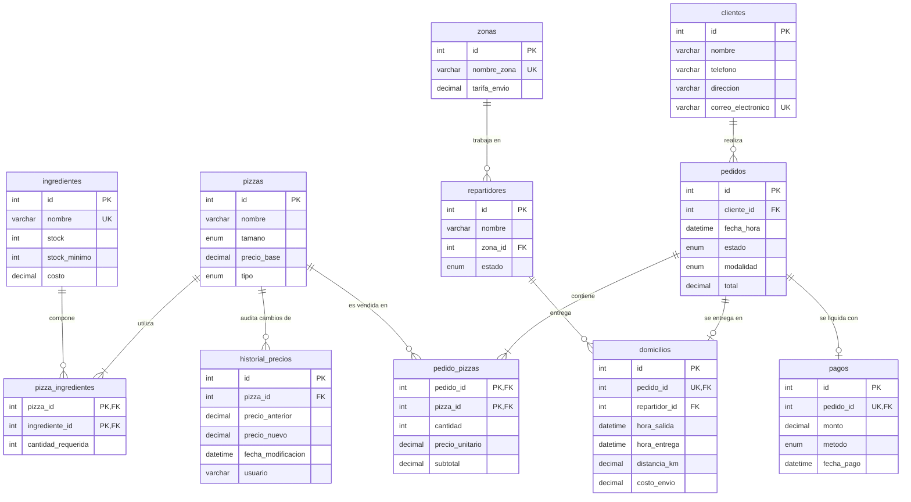

# Pizzería Don Piccolo - Sistema de Gestión de Pedidos y Domicilios

Este proyecto contiene el diseño e implementación de la base de datos relacional para la **Pizzería Don Piccolo**, desarrollada en **MySQL**. El sistema gestiona clientes, pizzas, ingredientes, pedidos, repartidores, domicilios y pagos, automatizando procesos clave a través de disparadores, funciones y procedimientos almacenados.

---

## 1. Estructura del Proyecto
El proyecto está organizado en los siguientes archivos SQL:
- **[database.sql](./database.sql)**: Estructura física, tablas, restricciones de integridad y llaves foráneas.
- **[funciones.sql](./funciones.sql)**: Funciones de cálculo financiero y procedimientos de negocio.
- **[triggers.sql](./triggers.sql)**: Automatización de stock, auditoría e integraciones de estados.
- **[vistas.sql](./vistas.sql)**: Vistas optimizadas para reportes comerciales.
- **[consultas.sql](./consultas.sql)**: Consultas avanzadas de negocio utilizando agrupaciones, subconsultas y uniones.
- **[datos_prueba.sql](./datos_prueba.sql)**: Datos semilla y simulaciones de prueba para validar el funcionamiento.

---

## 2. Diagrama de Relaciones y Modelo de Datos

A continuación se muestra el diseño relacional del sistema:



### Explicación de Decisiones de Diseño Clave
* **Tabla `pagos` normalizada**: Se creó una tabla `pagos` independiente para gestionar el método, monto y fecha de pago por separado del pedido, permitiendo la trazabilidad financiera del negocio.
* **Precio histórico en `pedido_pizzas`**: Almacenar `precio_unitario` en la tabla de relación rompe la dependencia del precio actual en `pizzas.precio_base`. Esto previene que si una pizza cambia de precio en el futuro, los totales de pedidos antiguos se alteren.
* **Tabla `zonas` independiente**: Evita texto libre en zonas de repartidores y automatiza el cálculo de la tarifa de envío del domicilio.
* **Hora de salida nullable**: Permite controlar cuándo inicia físicamente el recorrido de envío, no asumiendo el momento de creación del pedido.

---

## 3. Instrucciones de Ejecución

Para implementar la base de datos en su servidor MySQL local, ejecute los archivos en el siguiente orden estricto (debido a las dependencias de llaves foráneas y funciones requeridas por los triggers):

1. **Estructura física**:
   ```bash
   mysql -u tu_usuario -p < database.sql
   ```
2. **Funciones y Procedimientos**:
   ```bash
   mysql -u tu_usuario -p < funciones.sql
   ```
3. **Automatizaciones y Triggers**:
   ```bash
   mysql -u tu_usuario -p < triggers.sql
   ```
4. **Reportes y Vistas**:
   ```bash
   mysql -u tu_usuario -p < vistas.sql
   ```
5. **Datos de Prueba y Validación**:
   ```bash
   mysql -u tu_usuario -p < datos_prueba.sql
   ```
6. **Consultas de Negocio**:
   ```bash
   mysql -u tu_usuario -p < consultas.sql
   ```

---

## 4. Ejemplos de Lógica y Automatizaciones

### Disparador de Stock de Ingredientes
Al añadir pizzas a una orden, el disparador descuenta automáticamente las unidades necesarias de cada ingrediente:
```sql
CREATE TRIGGER trg_actualizar_stock_ingredientes
AFTER INSERT ON pedido_pizzas
FOR EACH ROW
BEGIN
    UPDATE ingredientes i
    JOIN pizza_ingredientes pi ON i.id = pi.ingrediente_id
    SET i.stock = i.stock - (pi.cantidad_requerida * NEW.cantidad)
    WHERE pi.pizza_id = NEW.pizza_id;
END;
```

### Cálculo Automático del Pedido Completo
Cuando se agregan pizzas o se registra un envío, el total del pedido se actualiza en cascada usando la función `fn_calcular_total_pedido`, la cual aplica el **IVA del 19%** al subtotal de pizzas y suma el costo de domicilio:
```sql
CREATE FUNCTION fn_calcular_total_pedido(p_pedido_id INT)
RETURNS DECIMAL(10, 2)
DETERMINISTIC
BEGIN
    DECLARE v_subtotal_pizzas DECIMAL(10, 2) DEFAULT 0.00;
    DECLARE v_costo_envio DECIMAL(10, 2) DEFAULT 0.00;
    DECLARE v_iva DECIMAL(10, 2) DEFAULT 0.00;

    SELECT COALESCE(SUM(subtotal), 0.00) INTO v_subtotal_pizzas FROM pedido_pizzas WHERE pedido_id = p_pedido_id;
    SELECT COALESCE(costo_envio, 0.00) INTO v_costo_envio FROM domicilios WHERE pedido_id = p_pedido_id;

    SET v_iva = v_subtotal_pizzas * 0.19;
    RETURN v_subtotal_pizzas + v_costo_envio + v_iva;
END;
```
